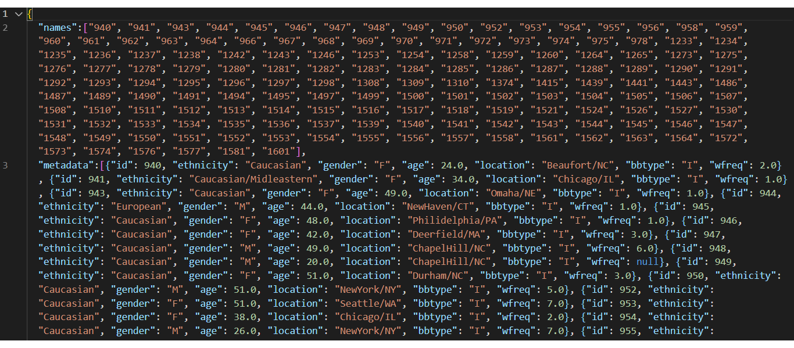

# Data Visualization Challenge
## By Michael Thomas

build an interactive dashboard to explore the [Belly Button Biodiversity dataset](http://robdunnlab.com/projects/belly-button-biodiversity/), which catalogs the microbes that colonize human navels.

## DATA
The dataset reveals that a small handful of microbial species (also called operational taxonomic units, or OTUs, in the study) were present in more than 70% of people, while the rest were relatively rare.

## Plotly

I used a D3 library to read in `samples.json`. Then using Plotly I created a horizontal bar chart with a dropdown menu to display the top 10 OTUs found in that individual. I used `sample_values` as the values for the bar chart, the `otu_ids` as the labels for the bar chart, and the `otu_labels` as the hovertext for the chart.

I used the same D3 and Plotly method to create a bubble chart that displays each sample. I used `otu_ids` for the x values, `sample_values` for the y values, `sample_values` for the marker size,`otu_ids` for the marker colors, and `otu_labels` for the text values.

JavaScript was used to update all of the plots any time that a new sample is selected.

HTML was used to create the displays. 
CSS and Bootstrap were used to style the data. 
JavaScript was used to create the functions.
